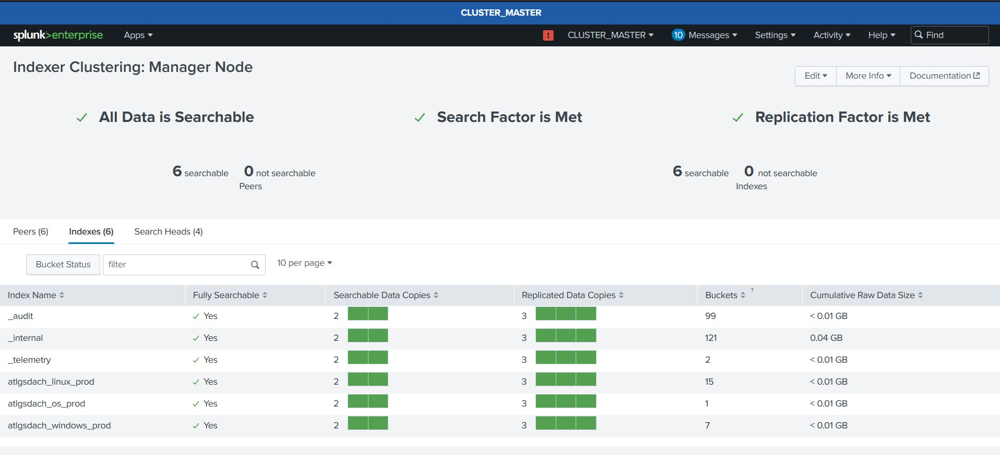
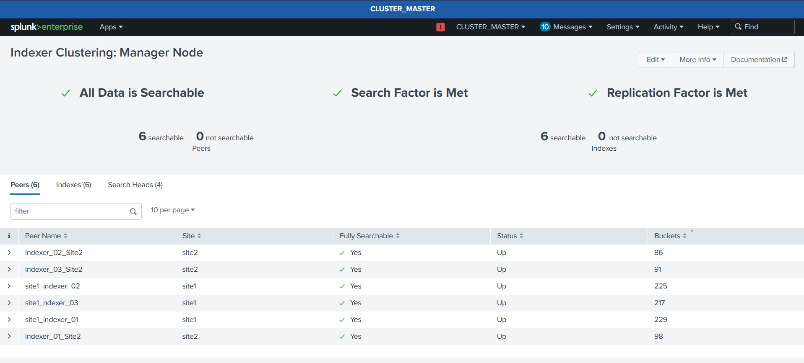

# 📘 Splunk Architecture – Complete Practical Notes

🚀 **Single-Site · Multi-Site · Search Head Clustering**

---

## 🔰 Overview

These notes document **hands-on Splunk architecture implementations** covering **single-site**, **multi-site indexer clustering**, and **search head clustering**, supported with real screenshots and configurations.

> 🎯 Purpose: Demonstrate **production-ready Splunk architecture knowledge** for **Architect / Observability / Platform Engineering** roles.

---

## 🧱 Core Splunk Components

🧠 **Indexer** – Stores & indexes data
🔍 **Search Head (SH)** – Runs searches & dashboards
🛠️ **Deployment Server** – Manages forwarders
👑 **Cluster Manager (Master Node)** – Controls indexer cluster
📜 **License Manager** – Manages licensing
📊 **Monitoring Console** – Cluster health & performance
🚚 **Forwarders (UF / HF)** – Data ingestion

---

## 🟢 Single-Site Indexer Clustering

### 🏗️ Architecture

* 1️⃣ Cluster Manager
* 🔄 Multiple Indexer Peers
* 🔍 Optional Search Head

### 🔑 Key Concepts

* 🔁 **Replication Factor (RF)** – Number of raw data copies
* 🔎 **Search Factor (SF)** – Searchable data copies
* 👑 **Captain Election** – Coordinates searches

### ✅ Benefits

* High Availability
* Fault Tolerance
* Horizontal Scaling

---

## 🔵 Search Head Clustering (SHC)

### 🧩 Components

* 🔍 Multiple Search Heads
* 🧰 Deployer
* 👑 SH Captain
* 🗄️ Shared KV Store

### ⚙️ Features

* Knowledge object replication
* User session failover
* HA dashboards

### 📌 Use When

* Many concurrent users
* Business‑critical dashboards
* Distributed search workloads

---

## 🟣 Multi-Site Indexer Clustering

### 🌍 Site Roles

* 🟢 **Site 1 (Primary)** – Active ingestion & search
* 🟡 **Site 2 (DR)** – Disaster recovery
* ⚫ **Site 0** – Cluster & License Manager

### ⚙️ Configuration

* `site_replication_factor`
* `site_search_factor`
* Preferred & failover sites

### 💡 Benefits

* Geo‑redundancy
* Disaster Recovery
* Compliance readiness

---

## 🔄 Data Flow & Index Creation

📥 Forwarders → 📦 Indexers → 🔁 Replication → 🔍 Search Heads

* Real‑time ingestion
* Bucket replication
* Searchable copy enforcement

---

## 📊 Monitoring & Health Checks

🧪 Monitored via:

* Monitoring Console
* Captain status
* RF/SF compliance
* Bucket fix‑up

---

## 🧠 CIM & Data Models

📚 **Common Information Model (CIM)**

* Normalized datasets
* Faster searches
* App compatibility (ES, ITSI)

---

## ⚡ Ingestion & Scaling Patterns

🚚 Universal Forwarders
🚛 Heavy Forwarders
⚖️ Load‑balanced Indexers
🔄 Parallel pipelines

---

## 🛠️ Troubleshooting & Operations

🧯 Common Tasks:

* Fix bucket issues
* Captain re‑election
* SHC rolling restarts
* Peer recovery

---

## 🖼️ Visual Proof (Screenshots)

---

## 🎯 Recruiter Signal

✅ Real infrastructure work
✅ Enterprise architecture thinking
✅ HA & DR mastery
✅ Observability‑ready skillset
✅ Senior‑level documentation

---

👨🏽‍💻 **Author:** Bernard Ofosu
🏷️ **Focus:** Splunk Architect · Observability · Cloud DevOps
