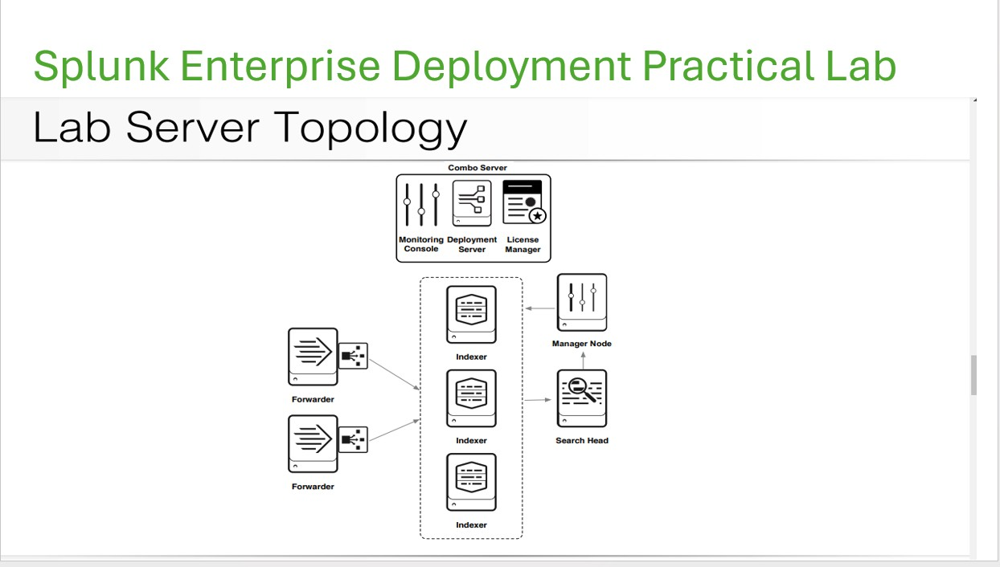
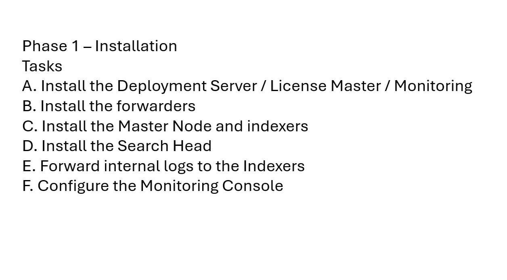
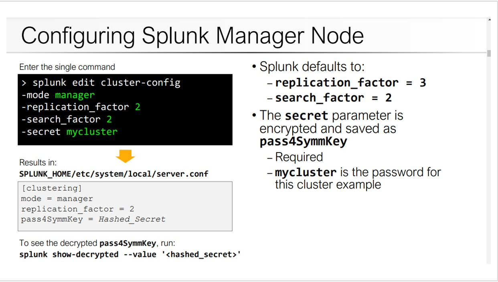
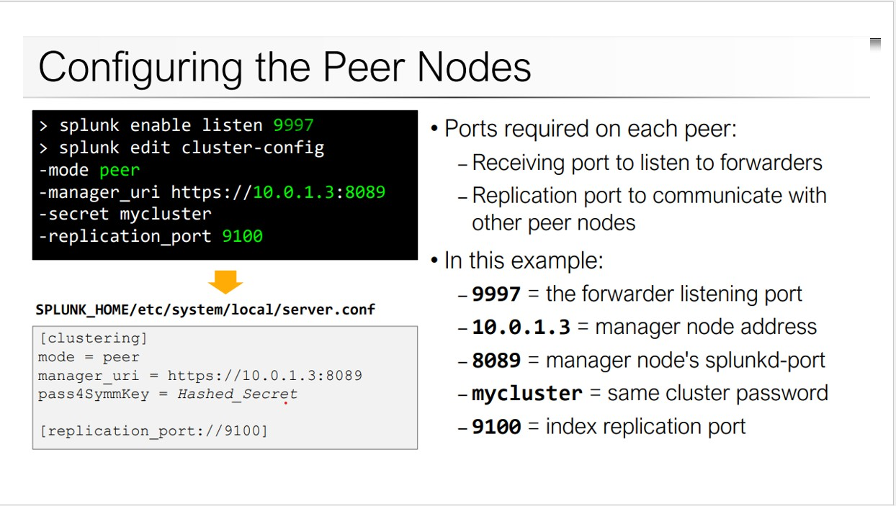
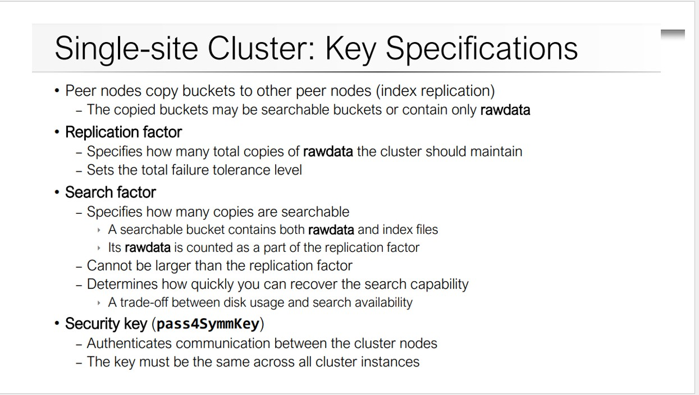

## Splunk Enterprise Deployment Practical Lab

This topology diagram shows the structure of a Splunk Enterprise Deployment Practical Lab. Here’s how each component fits into the deployment:

### Combo Server
- Combines multiple roles (Monitoring Console, Deployment Server, License Manager) into one server:
- Monitoring Console: Monitors the health and performance of the Splunk deployment.
- Deployment Server: Manages and pushes configuration updates to forwarders and other Splunk instances.
- License Manager: Manages and enforces Splunk licensing.

### Forwarders
- Collects data from different sources and sends it to the indexers for storage.
- Can be Universal Forwarders (lightweight) or Heavy Forwarders (filter/route data).

### Indexers
- Three indexers are shown, forming a Splunk Index Cluster:
- They store incoming data from forwarders.
- Data is searchable and replicated across indexers for high availability.

### Manager Node
- Manages the index cluster, ensuring replication and data consistency across the indexers.

### Search Head
- Executes search queries across the indexed data.
- Interfaces with the indexers to retrieve and display search results.

This topology follows Splunk best practices for scalability, search performance, and data redundancy

## Splunk Installation


## Configure Splunk Master Node


## Configure Splunk Peer Node


## Single Site Cluster


## Configure Manager Node Configuration File
### The are three ways to enable the manager node
The following example shows the basic settings that you typically configure when enabling a manager node. 

[Read More on Managing Indexers and Clusters of Indexers](https://docs.splunk.com/Documentation/Splunk/9.4.0/Indexer/Enableclustersindetail)

The configuration attributes for 1 and 2 correspond to fields on the Enable clustering page of Splunk Web.

#### 1. Configure using server.conf configuration file
Make sure this configuration is saved in `server.conf`, located at `$SPLUNK_HOME/etc/system/local/server.conf`. Restart the Splunk service to apply the changes.
```sh
[clustering]
mode = manager
replication_factor = 2
search_factor = 2
pass4SymmKey = your_secure_key
cluster_label = cluster1
```
**Restart Splunk**:
[Configure the manager node with server.conf](https://docs.splunk.com/Documentation/Splunk/9.4.0/Indexer/Configuremanagerwithserverconf)

The configuration example shown here in server.conf enables the manager node for Splunk clustering. 

Here's a breakdown of the key settings under the [clustering] stanza:
- mode = manager 🛠️: Specifies that this node acts as the cluster manager (also known as the cluster master).
- replication_factor = 2 📦: The number of copies of each piece of data (bucket) to be maintained across the cluster.
- search_factor = 2 🔍: The number of searchable copies of indexed data across the cluster.
- pass4SymmKey = whatever 🔑: The symmetric key used for authentication between cluster members. Ensure that all nodes in the cluster use the same key.
- cluster_label = cluster1 🏷️: An optional label to identify the cluster. It can help differentiate multiple clusters.

#### Configure using Splunk Command-Line Interface(CLI)
You have to be in the bin directory to run this command or full path

Bin Directory (`cd /opt/splunk/bin`)
```sh
./splunk edit cluster-config -mode manager -replication_factor 3 -search_factor 2 -secret your_key -cluster_label cluster1 splunk restart 
```
Full Path
```sh
opt/splunk/bin/splunk ./splunk edit cluster-config -mode manager -replication_factor 3 -search_factor 2 -secret your_key -cluster_label cluster1 splunk restart 
```

The with next line 
```sh
./splunk edit cluster-config \
  -mode manager \
  -replication_factor 2 \
  -search_factor 2 \
  -secret your_key \
  -cluster_label cluster1
./splunk restart
```
Without the backslashes (\), the shell would interpret each line as a separate command, leading to errors.

By adding \ at the end of each line, it’s treated as one continuous command.
[Configure the manager node with splunk CLI](https://docs.splunk.com/Documentation/Splunk/9.4.0/Indexer/ConfiguremanagerwithCLI)

🔑 The -secret flag modifies the pass4SymmKey setting in the [clustering] stanza of server.conf.

⚠️ When the manager node starts up for the first time, it will block indexing on the peers until you enable and restart the full replication factor number of peers.

🛑 Do not restart the manager while it is waiting for the peers to join the cluster. If you do, you will need to restart the peers a second time.

#### 1. Configure on the Splunk Web
[Configure on the Splunk Web](https://www.linkedin.com/pulse/how-create-indexer-cluster-splunk-under-10-mins-splunk-mania/)
[Enable the indexer cluster manager node](https://docs.splunk.com/Documentation/Splunk/9.4.0/Indexer/Enablethemanagernode)


## Configure peer nodes with server.conf
[Configure peer nodes with server.conf](https://docs.splunk.com/Documentation/Splunk/9.4.0/Indexer/Configurepeerswithserverconf)

[Configure the peer node with splunk CLI](https://docs.splunk.com/Documentation/Splunk/9.4.0/Indexer/ConfigurepeerswithCLI)

To configure peer nodes in Splunk, you can either edit the server.conf file or use the CLI. Here's a breakdown of both methods:
Manual Configuration (Editing server.conf)

To enable a peer node manually, add the following to server.conf:
```sh
[replication_port://9887]

[clustering]
manager_uri = https://10.152.31.202:8089  # Manager node's URI
mode = peer  # Set this node as a peer
pass4SymmKey = whatever  # The shared secret key for authentication
```
Explanation:
- replication_port://9887: The port used for replication communication.
- manager_uri: Specifies the address of the cluster manager.
- mode = peer: Indicates that this node acts as a peer.
- pass4SymmKey: Security key shared across all cluster members.

Once configured, restart Splunk to apply changes:
```sh
./splunk restart
```

CLI Configuration

Alternatively, you can use the following CLI command to configure a peer node:
```sh
./splunk edit cluster-config \
  -mode peer \
  -manager_uri https://10.160.31.200:8089 \
  -replication_port 9887 \
  -secret your_key
```
Then restart the Splunk instance:
```sh
./splunk restart
```
Why Use CLI?
- Simplifies Configuration: No need to manually edit server.conf.
- Consistency: Automatically applies settings without manual errors.
- Ease of Automation: Easily scriptable for multiple indexers.


### Check Peer Node Status
Run this command to see the status of all indexers:
```sh
/opt/splunk/bin/splunk show cluster-peers
```
[Change Hostname](./hostname.md)


## Configure the search head with server.conf
[Configure the search head with server.conf](https://docs.splunk.com/Documentation/Splunk/9.4.0/Indexer/Configuresearchheadwithserverconf)

## Configure the search head with the CLI
[Configure the search head with the CLI](https://docs.splunk.com/Documentation/Splunk/9.4.0/Indexer/ConfiguresearchheadwithCLI)

[Integrate the search head cluster with an indexer cluster in Distributed Search](https://docs.splunk.com/Documentation/Splunk/9.4.0/DistSearch/SHCandindexercluster)