# Splunk Distributed Search Setup

# 📊 Setting Up Monitoring Console

## 🖥️ Select a Host for Monitoring Console
1. 🔑 Log in to the instance you want to set up as a **monitoring console** (in our case, it will be the **DS**).
   
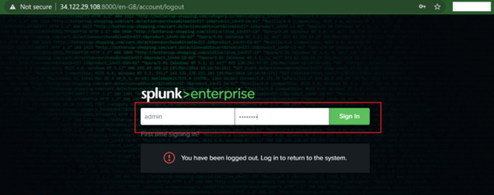

2. ⚙️ Navigate to **Settings** → **Distributed Search** → **Search Peer**.
   
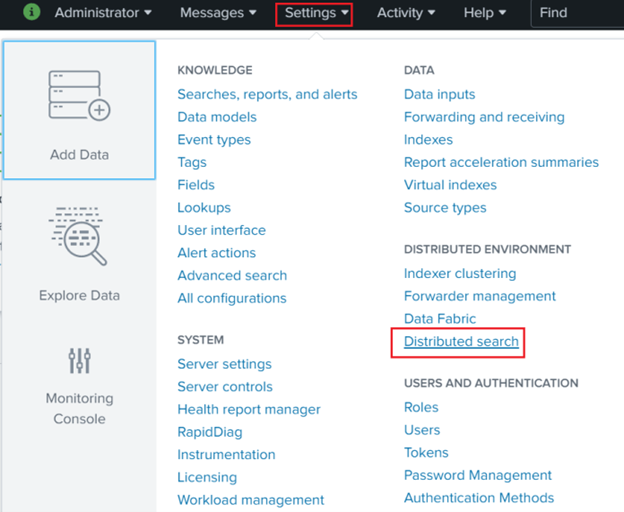

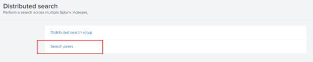

3. ➕ Click on **New Search Peer** and add:
   - 🔎 All **search heads**
   - 🔑 **License master**
   - 📦 **Non-clustered indexers**
   - 🔍 **Clustered search heads**

🔄 Repeat this process based on the number of instances you want to add.

❗ **Note:** No need to add **DS**, as it is automatically included.
   
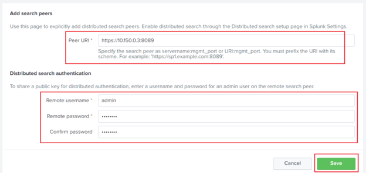

4. ✅ Verify that all search peers have been successfully added.
   
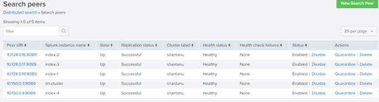

---

## ⚙️ General Setup of Monitoring Console

5. 🏗️ Navigate to **Settings** → **Monitoring Console** → **Settings** → **General Setup**
   
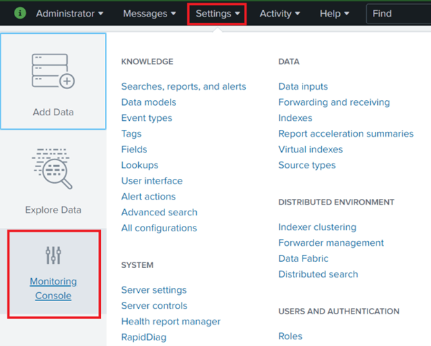
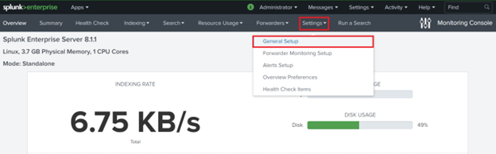

6. 🌐 Click on **Distributed** and continue.
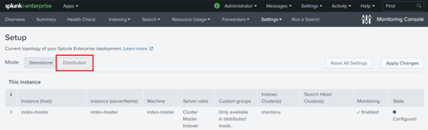

7. 📌 Scroll down and check the status of all **remote instances**.
   
  

8. 🔄 Verify **server roles**:
   - If incorrect, click on **Action** → **Edit**
   - 🎯 Update **Server Roles**
   - ✅ Click on **Apply Changes**
   
   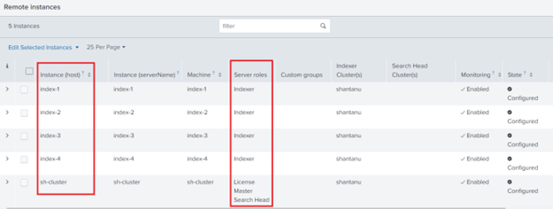
   
   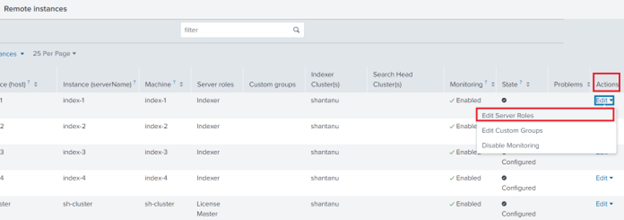

9. 📊 Go to the **Overview Page** of your newly set up **Monitoring Console**.
   
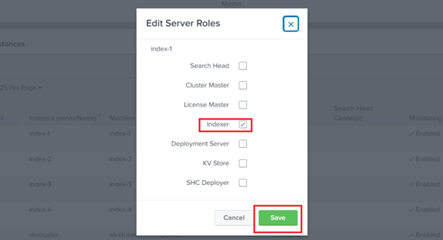
   
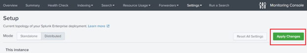
   
   🎉 **Happy Splunking!** 🚀

---

## 🔎 Monitoring Forwarders
✅ **No configuration required from the forwarders' side.**

🔧 In the **Monitoring Console**:
- **MC** → **Settings** → **Forwarder Monitoring Setup** → **Enable Forwarder Monitoring** → **Save**
  
  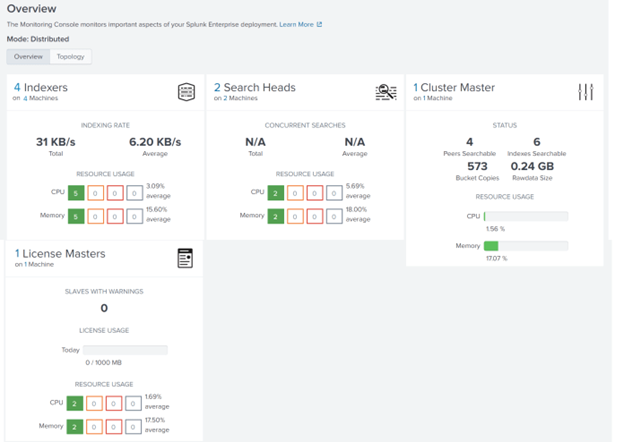

⏳ After some time:
- **MC** → **Forwarders** → **Forwarders: Deployment** shows:
  - 🖥️ List of forwarders
  - 💡 Forwarder health status

❗ **Note:** Deployment server **cannot** monitor forwarder health.
